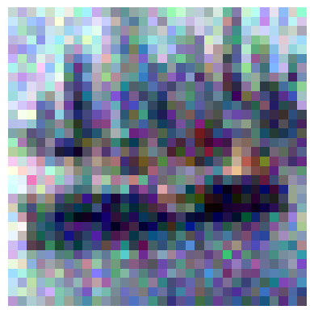

# Denoising Autoencoder for Image Reconstruction

In this project I implement 2 denoising autoencoders from scratch using PyTorch to denoise images from both the MNIST, and CIFAR-10 Datasets

## Overview

The project demonstrates how to reconstruct clean images from noisy inputs using custom-designed autoencoder architectures. The models compress noisy images into a latent representation and then decode them to produce clean, reconstructed versions.

## Key Features

- Custom denoising autoencoder architectures for both grayscale (MNIST) and RGB (CIFAR-10) images
- Gaussian noise injection with configurable noise levels
- Skip connections in the CIFAR-10 model to preserve spatial details
- Training and evaluation pipelines with visualization of results

## Approach

1. **Dataset Preparation**: Created noisy versions of MNIST and CIFAR-10 by adding Gaussian noise
2. **Model Architecture**:
   - For MNIST: A simpler architecture with convolutional layers, max pooling, and transposed convolutions
   - For CIFAR-10: A more complex architecture with batch normalization, skip connections, and a dedicated bottleneck
3. **Training**: Models trained using MSE loss and Adam optimizer over multiple epochs
4. **Evaluation**: Visual comparison of noisy inputs, model reconstructions, and original images

## Visualizations

### Noisy Input Examples

#### MNIST (30% noise factor)

  

#### CIFAR-10 (10% noise factor)

  

### Model Architectures

#### MNIST Architecture

#### CIFAR-10 Architecture

### Denoising Results

#### MNIST Denoising

_Top: Noisy inputs | Middle: Reconstructed outputs | Bottom: Original clean images_

#### CIFAR-10 Denoising (after 30 epochs)

_Top: Noisy inputs | Middle: Reconstructed outputs | Bottom: Original clean images_

## Results

The models successfully learn to remove noise from images, reconstructing visually clear outputs that closely match the original images. The CIFAR-10 model uses skip connections to better preserve fine details in the reconstructed RGB images.

## Notebook Contents

The Jupyter notebook "Denoising Autoencoder on CIFAR-10, MNIST.ipynb" contains the complete implementation, including:

- Dataset creation and preprocessing
- Model implementation
- Training loops
- Visualization of results
